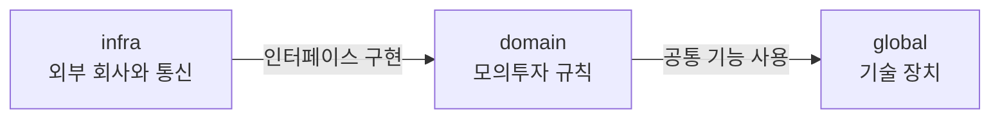

# PaperTrading

실시간 시세 기반 모의 주식 투자 백엔드입니다.

>  지금은 패키지 구조를 설계한 단계입니다. 각 패키지는 첫 코드가 들어갈 때 저장소에 함께 올라갑니다.

<br>

## PaperTrading이란

가상 예수금으로 국내 주식을 사고파는 모의투자 서비스의 백엔드입니다. 키움증권 API에서 받은 실시간 시세로 주문을 체결합니다.

### 왜 만드는가

2025년 팀 프로젝트로 만든 모의투자 서비스 **CHICKEN STOCK**의 재작성입니다.

프로젝트가 끝나고 1년 뒤 리팩토링하려다 멈추고, 코드베이스를 11개 영역으로 나눠 정적 감사부터 했습니다. 대표 결함 5건이 나왔고, 상당수가 국소적 버그가 아니라 설계 단계에서 반복된 패턴이었습니다. 하나씩 고쳐도 다음 기능에서 같은 방식으로 다시 생긴다고 판단해, 개별 수정 대신 처음부터 다시 짜기로 했습니다.

감사 결과와 함께, 다른 팀 프로젝트 DOROLAW · TOGETHER BUY에서 배운 것도 설계에 반영합니다.

- 감사 리포트 · 회고 — [CHICKEN STOCK](https://minsedit.vercel.app/work/chicken-stock) · [DOROLAW](https://minsedit.vercel.app/work/dorolaw) · [TOGETHER BUY](https://minsedit.vercel.app/work/together-buy)

### 다루는 범위

- 회원가입 · 로그인
- 가상 예수금 계좌
- 시장가 · 지정가 주문과 체결
- 실시간 시세 구독 · 전송
- 보유 종목 · 평가손익

### 하지 않는 것

- 실거래 주문 전송 — 모의투자만 다룹니다
- 프론트엔드

<br>

## 디렉토리 구조

```
src/main/java/com/mins/papertrading
├── domain                  모의투자의 규칙
│   ├── auth                로그인 · 토큰 재발급 · 로그아웃
│   ├── member              회원
│   ├── account             계좌 · 예수금
│   ├── stock               종목 정보
│   ├── market              시세 · 구독 · 실시간 전송
│   ├── order               주문 · 체결
│   └── holding             보유 종목 · 포트폴리오
│
├── global                  주식을 모르는 기술 장치
│   ├── common              공통 엔티티 · 응답 형식
│   ├── config              빈 등록 · 설정
│   ├── exception           공통 에러 코드 · 전역 예외 처리
│   ├── scheduler           모든 스케줄 작업의 실행 시각
│   ├── security            보안 설정 · 인증 필터 · JWT
│   └── websocket           WebSocket 세션 관리 · 메시지 전송
│
└── infra                   외부 회사와 통신하는 코드
    └── kiwoom              키움증권 인증 · REST · WebSocket
```

### 도메인 패키지 안의 구성

모든 도메인 패키지는 같은 모양을 따릅니다.

```
domain/{도메인}
├── controller      바깥에서 들어오는 입구 — REST 컨트롤러, WebSocket 핸들러
├── dto
│   ├── request
│   └── response
├── entity          JPA 엔티티 · enum
├── exception       이 도메인의 에러 코드
├── repository      JPA 리포지토리
├── service         비즈니스 로직
└── event           다른 도메인에 알릴 이벤트 (필요할 때만)
```

하위 폴더는 첫 클래스를 넣을 때 만듭니다. <br>
- 작업 환경이 달라질 경우: 새 패키지를 만들면 `package-info.java`에 그 패키지가 맡는 일을 한 줄로 적습니다.

### 새 클래스를 어디에 둘까

아래 질문을 순서대로 확인합니다.

1. **키움 같은 외부 회사와 직접 통신하는가?** → `infra/{회사 이름}`
2. **주식 · 주문 · 계좌 · 시세 같은 개념을 다루는가?** → `domain/{그 개념}`
   어느 도메인인지 헷갈리면, 그 코드가 바꾸는 엔티티가 있는 패키지로 갑니다.
3. **둘 다 아니면** → `global`

### 패키지끼리 부르는 방향



| 방향 | 허용 | 이유 |
|---|---|---|
| `domain` → `global` | O | 공통 응답, 예외, 현재 로그인한 회원 조회를 씁니다 |
| `infra` → `domain` | O | 도메인이 정한 인터페이스를 구현합니다 |
| `domain` → `infra` | X | 도메인은 인터페이스만 압니다. 테스트할 때 키움 대신 가짜 시세를 끼울 수 있게 하기 위해서입니다 |
| `global` → `domain` | X | 기술 장치에 모의투자 규칙이 섞이지 않게 합니다 |
| └ `global/config`, `global/scheduler` | O | 예외입니다. 핸들러를 경로에 등록하고 스케줄마다 도메인 서비스를 불러야 해서, 도메인을 알아야 합니다 |
| `domain` → 다른 `domain` | service만 | 다른 도메인의 리포지토리를 직접 쓰지 않습니다. 그 도메인의 엔티티는 그 도메인의 서비스를 거쳐 바꿉니다 |

두 도메인이 서로를 불러야 하는 상황이 생기면, 한쪽은 이벤트를 발행하고 다른 쪽은 그 이벤트를 받는 방식으로 바꿉니다.

<br>

## 커밋 규칙

### 메시지 형식

```
<타입>: <무엇을 했는지 한 줄>

<왜 바꿨는지>
<CHICKEN STOCK과 달라진 점이 있으면 "이전:"으로 적는다>
```

| 타입 | 쓰는 때 |
|---|---|
| `feat` | 기능 추가 |
| `fix` | 버그 수정 |
| `refactor` | 동작은 그대로 두고 구조만 변경 |
| `test` | 테스트 추가 · 수정 |
| `docs` | README · ADR 등 문서 |
| `chore` | 빌드 · 설정 · 패키지 구조 |

### 지키는 것

1. 커밋 하나에는 변경 하나만 담는다.
2. 동작을 추가하거나 바꾸는 커밋에는 그 동작을 검증하는 테스트를 함께 넣는다.
3. 커밋하기 전에, 들어가는 코드를 한 줄씩 설명할 수 있는지 확인한다. AI 도구로 작성한 코드도 같다.
4. 선택지가 둘 이상이었던 결정은 `docs/adr/`에 기록하고, 커밋 본문에 ADR 번호를 적는다.
5. `main`은 항상 빌드와 테스트가 통과하는 상태로 둔다.

### 브랜치

- `main` — 항상 동작하는 상태
- 작업 브랜치 — `feat/account-ledger`, `fix/order-cancel`처럼 타입과 내용을 영문 소문자와 하이픈으로 적는다
- 작업 브랜치는 PR로 `main`에 합치고, PR 설명에 무엇을 왜 바꿨는지 적는다

### 예시

```
chore: ChickenStock 감사 결과를 반영해 패키지 구조 재설계

- 스케줄 실행 시각을 global/scheduler 한 곳으로
  이전: member · notification · rank · stock · auth, WebSocket 핸들러 안에 분산
- 주문과 체결을 domain/order 하나로
  이전: 엔티티는 stock/entity, 서비스는 stock/trade/service
- 키움 통신을 infra/kiwoom으로 분리
  이전: stock/service, stock/trade/service, stock/websocket/client
- 보안 코드를 global/security 하나로
  이전: security/, config/security/, common/util, stock/trade/service
```